# BarkBuddy

BarkBuddy is an innovative social platform designed for pet lovers. The app facilitates connections between pet owners, allowing them to share stories, participate in events, and communicate through messages. Our goal is to build a vibrant community where users can find support, friendship, and inspiration for their furry friends.

## Iteration 2 Overview

### Current Achievements

- **Authentication**: Implemented Firebase Authentication and validate user information during certain CRUD operations.
- **External API**:

1. The Dog API: The `UserScreen` utilizes the [The Dog API](https://www.thedogapi.com) to fetch a list of dog breeds.
2. Country State City API: The [Country State City API](https://countrystatecity.in/docs/api/all-countries/) is used in the `EditUser` component to retrieve lists of countries, states by country ([states-by-country](https://countrystatecity.in/docs/api/states-by-country/)), and cities by state & country ([cities-by-state-country](https://countrystatecity.in/docs/api/cities-by-state-country/)).

- **CRUD**: Implemented more CRUD operations in `UserScreen`. And Create operation in Post screen(user can click add button and upload images and text to firebase post collection)
- **Camera**: Inside the post feature, when user cilck add button it will show series edit page to genarete a post, in this feature, user can select image from album and upload them.But there still have some function sould be update, like selected multiple images, use camera take photo to replace/update the previous selected images ect.I will kkep work on that until iteration3.

#### Post Screen(with CRUD)

- Introduced a story scroll list at the top, displaying stories posted by friends.
- Users can view posts from friends and strangers, like posts, and leave comments through a comment modal.
- Direct access to user profiles by clicking on user avatars.
- An add button on the right part of the header for creating posts (currently inactive as CRUD operations will be implemented in iteration 3).

#### Event Screen(with CRUD)

- Consists of two screens: Events and My Events.
- On the header, there is an Add Pressable on the right side, which navigates to the "Add An Event" screen. Users can create a new event on the "Add An Event" screen.
- Events screen read data from database, displays all events created by users
- My Events screen read data that matches generated by the current user, allows users to browse, update, and delete events created by themselves.

#### Message Screen

- Designed with two flat lists: one for messages from strangers and another for messages from friends, with options to accept or reject messages.
- A create button allows users to start new conversations with friends.
- Initial layout completed.

#### Profile Screen

- Conditional rendering based on user state.
- Prompt the user to add basic profile info if we cannot find its corresponding doc in firebase.
- Implemented create, read and update to user profile info through UserScreen and EditUser.
- Display of recent posts (using hardcoded data currently).

### Planned Features for Iteration 3

- **Post Screen**: Integration with Firebase for creating and displaying posts, including comment functionalities.
- **Message Screen**: Decision on implementing a messaging or invitation system, followed by CRUD operation development.
- **Profile Screen**: Implementation of fetching and displaying posts from Firebase.

<!-- ## CRUD Operations -->

<!-- Currently, CRUD operations have been implemented for the Events collection, Users collection and Posts collection. This allows for the creation, reading, updating, and deletion of event data, enabling dynamic interaction with event information within the BarkBuddy platform. -->

## Screenshots and Contributions

### Contributions

Our team members have made contributions to the development of BarkBuddy, each bringing their expertise to different aspects of the application:

- **Login/Signup Screen**: Developed by Yijing Wu, providing a seamless entry point for new and returning users, and for authentication.
- **Post Screen**: Developed by Ruilin Sun, enabling users to share and engage with content related to their pets.
- **Create Post Screen**: Developed by Ruilin Sun, enable user to selected image and input text to create their post.
- **User Screen**: Modified by Yijing Wu, updates include changing the Avatar and Puppy Cards to Pressable components, implementing a modal for editing/adding puppy information, and adding conditional rendering for the style of ScrollView to improve user interaction.
- **Firebase Integration for Users**: Completed by Yijing Wu, saved the information users added for their basic profile and their dog information to the 'users' collection and 'puppyList' subcollection in Firebase and displayed these information by fetching it from Firebase.

### Screenshots

Below are some screenshots showcasing the current UI and functionalities of the BarkBuddy app. These images provide a glimpse into the user experience and interface design of our platform.

| Login | Register | Post |
|---------|---------|---------|
|  |  | 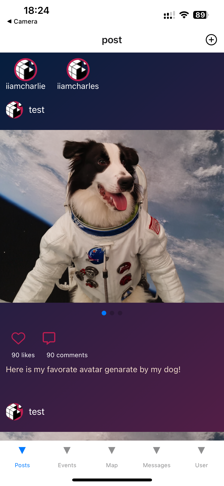 |

| Add Post | Add Post | Add Post |
|---------|---------|---------|
| 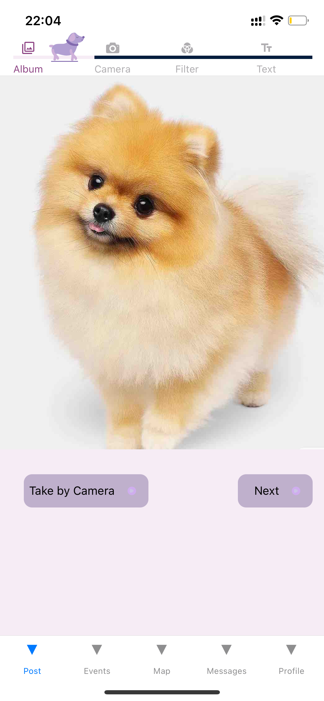 | 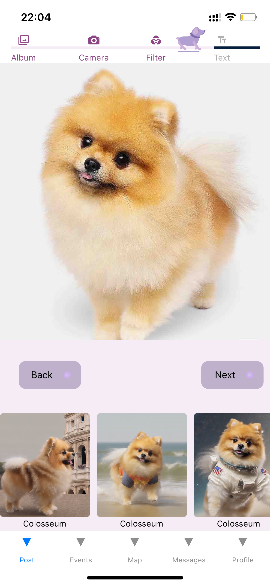 | 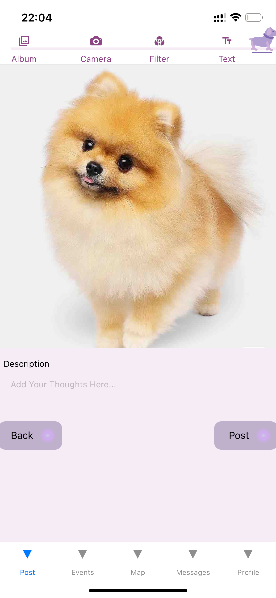 |

| Events | My Events | Add Event |
|---------|---------|---------|
|  |  | 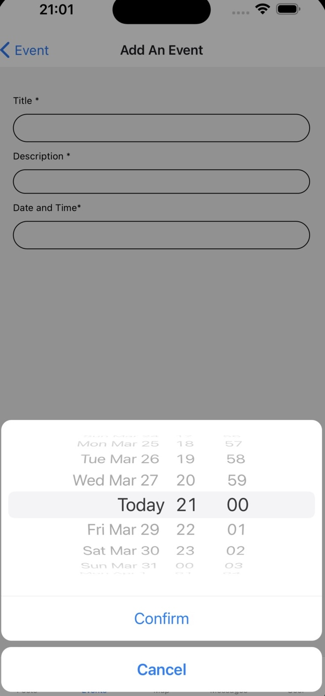 |

| Message | User Profile | Add Puppy Modal |
|---------|---------|---------|
|  |  | 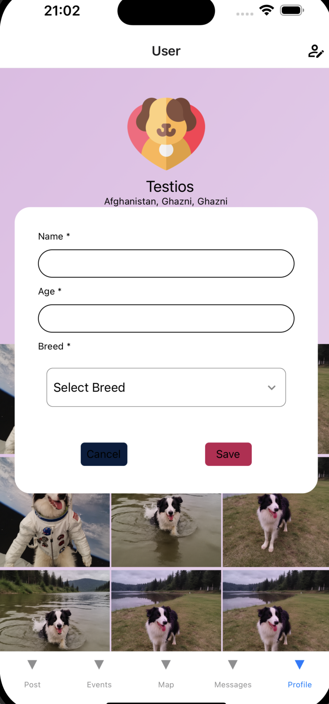 |

| Breed List | Edit User |  |
|---------|---------|---------|
| 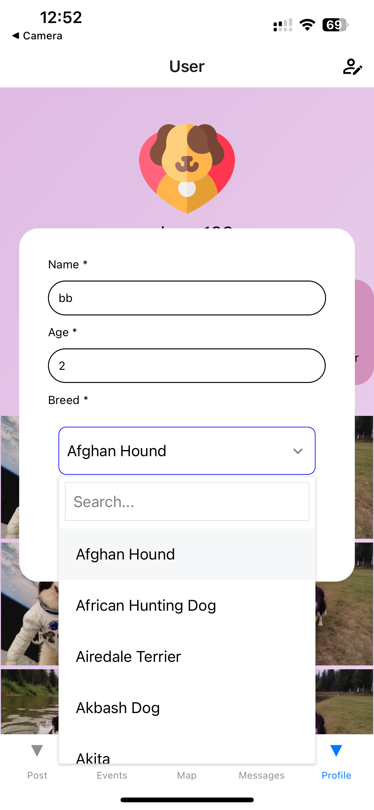 | 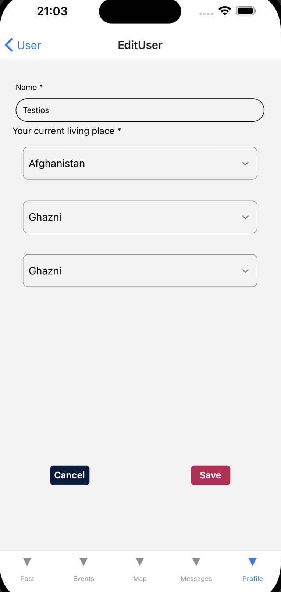 ||

| Country List | State List | City List |
|---------|---------|---------|
| 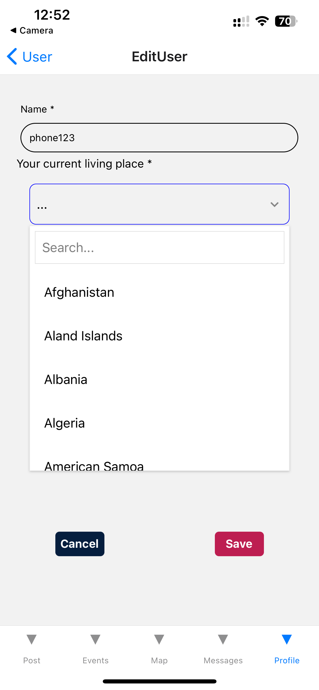 | 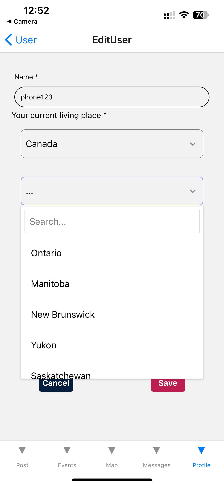 | 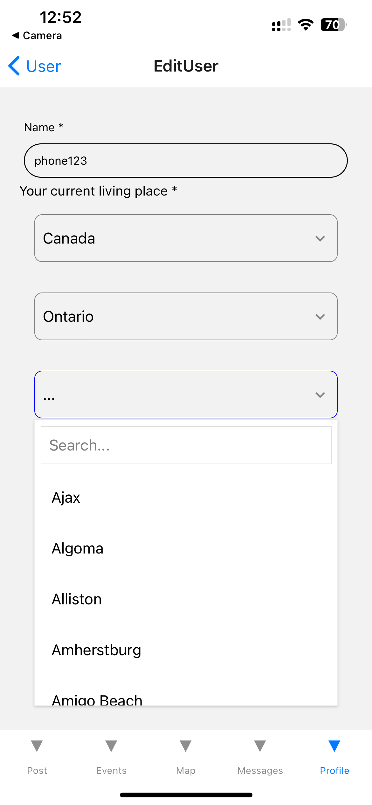 |

## Data Model

The Firestore rule:

```firebase
rules_version = '2';

service cloud.firestore {
  match /databases/{database}/documents {

    // This rule allows anyone with your Firestore database reference to view, edit,
    // and delete all data in your Firestore database. It is useful for getting
    // started, but it is configured to expire after 30 days because it
    // leaves your app open to attackers. At that time, all client
    // requests to your Firestore database will be denied.
    //
    // Make sure to write security rules for your app before that time, or else
    // all client requests to your Firestore database will be denied until you Update
    // your rules
    match /{document=**} {
    	allow create ,read ,update ,delete: if request.auth != null;
    }
  }
}
```

We will utilize three primary collections:

```json
Users Collection (Email and Password are handled by Authentication)
{
  "userId": "",
  "name": "",
  "avatar": "",
  "city": "",
  "state": "",
  "country": "",
  "stateCode": "",
  "countryCode": "",
  "puppyList": [
    {
      "name": "",
      "age": "",
      "breed": "",
      "breedId": ""
    },
    {
      "name": "",
      "age": "",
      "breed": "",
      "breedId": ""
    },
    ...
  ]
}

Posts Collection
{
  "userId": "",
  "images": [],
  "likeNumbers": 0,
  "commentNumbers": 0,
  "comments": [
    {
      "userId": "",
      "content": ""
    },
    {
      "userId": "",
      "content": ""
    },
    ...
  ]
}

Events Collection
{
  "title": "",
  "description": "",
  "image": "",
  "location": "",
  "date": null -> Date,
  "Organizer": "",
}
```

## Notice

To prevent potential version conflict, you can run "npx expo install react-native-gesture-handler ", or try between react-native-gesture-handler@~2.14.0 and react-native-gesture-handler@~2.16.0.
