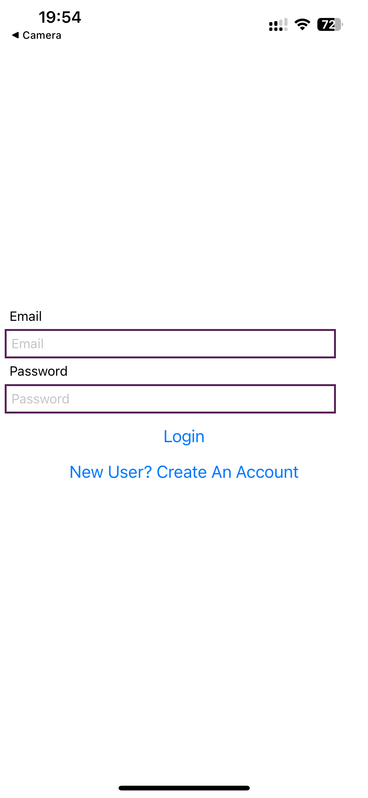
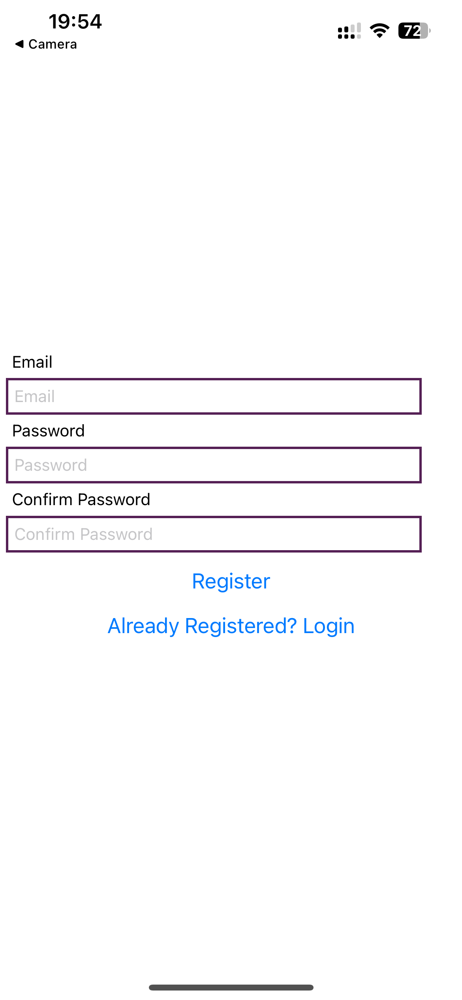
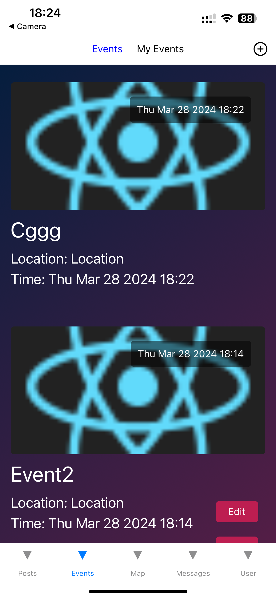
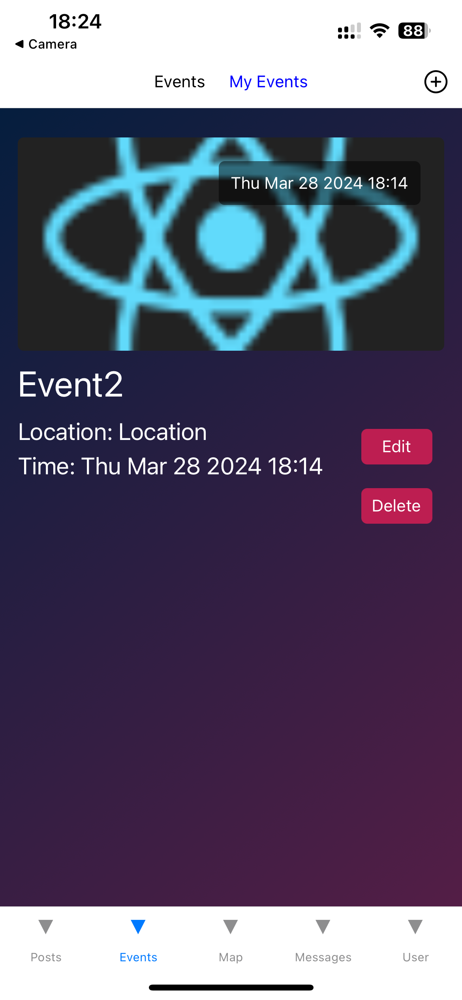
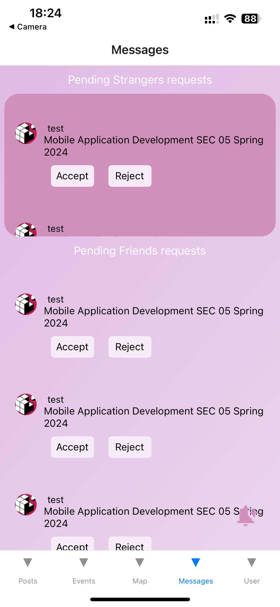
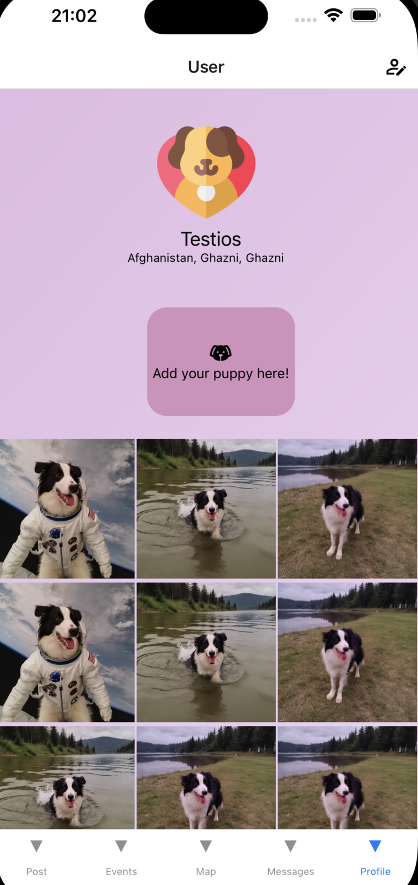

# BarkBuddy

BarkBuddy is an innovative social platform designed for pet lovers. The app facilitates connections between pet owners, allowing them to share stories, participate in events, and communicate through messages. Our goal is to build a vibrant community where users can find support, friendship, and inspiration for their furry friends.

## Iteration 1 Overview

### Current Achievements

- **Navigation Transition Architecture**: Implemented a robust navigator transition architecture, ensuring smooth navigation across different screens.
- **Screen Layouts**: Established basic layouts for the Post, Event, Message, and Profile screens. The Map screen layout is planned for the next iteration.
- **CRUD**: implemente the CRUD operations in eventscreen.

#### Post Screen

- Introduced a story scroll list at the top, displaying stories posted by friends.
- Users can view posts from friends and strangers, like posts, and leave comments through a comment modal.
- Direct access to user profiles by clicking on user avatars.
- An add button on the right part of the header for creating posts (currently inactive as CRUD operations will be implemented in iteration 2).

#### Event Screen

- Consists of two screens: Events and My Events.
- On the header, there is an Add Pressable on the right side, which navigates to the "Add An Event" screen. Users can create a new event on the "Add An Event" screen.
- Events screen read data from database, displays all events created by users
- My Events screen read data that matches generated by the current user, allows users to browse, update, and delete events created by themselves.

#### Message Screen

- Designed with two flat lists: one for messages from strangers and another for messages from friends, with options to accept or reject messages.
- A create button allows users to start new conversations with friends.
- Initial layout completed.

#### Profile Screen

- Conditional rendering based on user authentication.
- Information collection process for new users to facilitate automatic profile creation.
- Display of recent posts (using hardcoded data currently).

### Planned Features for Iteration 2

- **Post Screen**: Integration with Firebase for creating and displaying posts, including comment functionalities.
- **Message Screen**: Decision on implementing a messaging or invitation system, followed by CRUD operation development.
- **Profile Screen**: Implementation of fetching and displaying posts from Firebase.

## CRUD Operations

Currently, CRUD operations have been implemented for the Events collection. This allows for the creation, reading, updating, and deletion of event data, enabling dynamic interaction with event information within the BarkBuddy platform.

## Screenshots and Contributions

### Contributions

Our team members have made significant contributions to the development of BarkBuddy, each bringing their expertise to different aspects of the application:

- **Login/Signup Screen**: Developed by Yijing Wu, providing a seamless entry point for new and returning users.
- **Post Screen**: Developed by Ruilin Sun, enabling users to share and engage with content related to their pets.
- **Event Screen**: Developed by Yijing Wu, allowing users to discover and create pet-related events.
- **Message Screen**: Developed by Ruilin Sun, facilitating direct communication between users.
- **Profile Screen**: Developed by Ruilin Sun, offering a personalized space for users to showcase their pets and stories.
- **Firebase Integration for Events**: Completed by Yijing Wu, ensuring robust backend support for event management.

### Screenshots

Below are some screenshots showcasing the current UI and functionalities of the BarkBuddy app. These images provide a glimpse into the user experience and interface design of our platform.









## Data Model

We will utilize three primary collections:

```json
Users Collection (Email and Password are handled by Authentication)
{
  "userId": "",
  "name": "",
  "avatar": "",
  "location": "",
  "petNumbers": 0
}

Posts Collection
{
  "userId": "",
  "images": [],
  "likeNumbers": 0,
  "commentNumbers": 0,
  "comments": [
    {
      "userId": "",
      "content": ""
    },
    {
      "userId": "",
      "content": ""
    },
    ...
  ]
}

Events Collection
{
  "title": "",
  "description": "",
  "image": "",
  "location": "",
  "date": null -> Date,
  "Organizer": "",
}
```
