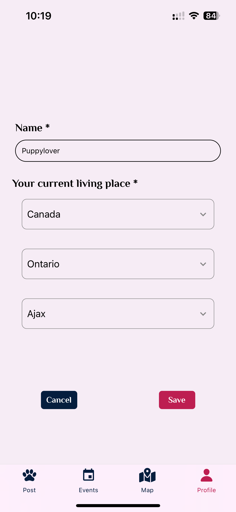

# BarkBuddy

BarkBuddy is an innovative social platform designed for pet lovers. The app facilitates connections between pet owners, allowing them to share stories, participate in events, and communicate through messages. Our goal is to build a vibrant community where users can find support, friendship, and inspiration for their furry friends.

Here is a brief video introduction to our app: https://www.youtube.com/watch?v=WDKOhaXyIQg

## Final Version Overview

### Current Achievements

- **Notification**: Implemented local notification for add event.
- **External API**:

1. The Dog API: The `UserScreen` utilizes the [The Dog API](https://www.thedogapi.com) to fetch a list of dog breeds.
2. Country State City API: The [Country State City API](https://countrystatecity.in/docs/api/all-countries/) is used in the `EditUser` component to retrieve lists of countries, states by country ([states-by-country](https://countrystatecity.in/docs/api/states-by-country/)), and cities by state & country ([cities-by-state-country](https://countrystatecity.in/docs/api/cities-by-state-country/)).
3. The Geocode API: The `Add Event` utilizes the [The Geocode API](https://geocode.maps.co) to convert latlng to real address. (Newly Added in 3rd iteration!)

- **Location and Map**: Implemented `MapScreen` to use statistic Google Map, and set Markers for different events' location. Also use map in create/update event so that users can select the location to hold the event.
- **Camera**: Inside the post feature, when user cilck add button it will show series edit page to genarete a post, in this feature, user can select image from album and upload them, also user can click camera button and give permission to take photo.

#### Post Screen(with CRUD)

- Users can view posts from friends and strangers, like posts, and add comments.
- An add button on the right part of the header for creating posts, user can upload image from album, also can take photo by camera, and delete or change the image before submit, and add text in the post.

#### Event Screen(with CRUD)

- Consists of two screens: Events and My Events.
- On the header, there is an Add Pressable on the right side, which navigates to the "Add An Event" screen. Users can create a new event on the "Add An Event" screen.
- Events screen read data from database, displays all events created by users
- My Events screen read data that matches generated by the current user, allows users to browse, update, and delete events created by themselves.

#### Map Screen

- Use GoogleMap API to show a styled map nearby the current user's location.
- Have a red marker as current location, and other blue markers as nearby events.
- Users can click marker to see the title of events.

#### Profile Screen(with CRUD)

- Conditional rendering based on user state.
- Prompt the user to add basic profile info if we cannot find its corresponding doc in firebase.
- Implemented create, read and update to user profile info through UserScreen and EditUser.
- Display of current user's recent posts.

<!-- ### Planned Features for Iteration 3

- **Post Screen**: Integration with Firebase for creating and displaying posts, including comment functionalities.
- **Message Screen**: Decision on implementing a messaging or invitation system, followed by CRUD operation development.
- **Profile Screen**: Implementation of fetching and displaying posts from Firebase. -->

<!-- ## CRUD Operations -->

<!-- Currently, CRUD operations have been implemented for the Events collection, Users collection and Posts collection. This allows for the creation, reading, updating, and deletion of event data, enabling dynamic interaction with event information within the BarkBuddy platform. -->

## Screenshots and Contributions

### Contributions

Our team members have made contributions to the development of BarkBuddy, each bringing their expertise to different aspects of the application:

- **Login/Signup Screen**: Developed by Yijing Wu, providing a seamless entry point for new and returning users, and for authentication.
- **Post Screen**: Developed by Ruilin Sun, enabling users to share and engage with content related to their pets and to selected image and input text to create their post.
- **Event Screen**: Developed by Yijing Wu, enable user to view all the events and events created by themselves, also create, update, delete their own events.
- **Map Screen**: Developed by Yijing Wu and styled by Ruilin Sun, enable user to view all the events and events created by themselves, also create, update, delete their own events.
- **User Screen**: Developed by Ruilin and Yijing, both worked on styling, Ruilin focused on Avatar and Recent Post part, Yijing focused on the other parts related to users and puppies information. Enabling users to add, and edit their basic information, add their puppies’ information which is displayed as cards and see their recent posts.

### Screenshots

Below are some screenshots showcasing the current UI and functionalities of the BarkBuddy app. These images provide a glimpse into the user experience and interface design of our platform.

| Sign Up                                                         | Log In                                                        | Post                                                       |
| --------------------------------------------------------------- | ------------------------------------------------------------- | ---------------------------------------------------------- |
|  |  |  |

| Create Post                                                             | Create Post                                                              | Event                                                         |
| ----------------------------------------------------------------------- | ------------------------------------------------------------------------ | ------------------------------------------------------------- |
|  |  |  |

| Event                                                           | Create Event                                                           | Create Event                                                            |
| --------------------------------------------------------------- | ---------------------------------------------------------------------- | ----------------------------------------------------------------------- |
|  |  |  |

| Map                                                      | User Profile                                               | Add Puppy Modal                                                  |
| -------------------------------------------------------- | ---------------------------------------------------------- | ---------------------------------------------------------------- |
|  |  |  |

| Edit User                                                       |     |     |
| --------------------------------------------------------------- | --- | --- |
|  |     |     |

## Data Model

The Firestore rule:

```firebase
rules_version = '2';

service cloud.firestore {
  match /databases/{database}/documents {

    // This rule allows anyone with your Firestore database reference to view, edit,
    // and delete all data in your Firestore database. It is useful for getting
    // started, but it is configured to expire after 30 days because it
    // leaves your app open to attackers. At that time, all client
    // requests to your Firestore database will be denied.
    //
    // Make sure to write security rules for your app before that time, or else
    // all client requests to your Firestore database will be denied until you Update
    // your rules
    match /users/{document} {
  		allow create: if request.auth != null;
  		allow read, update, delete: if request.auth != null && request.auth.uid == resource.data.userId;
		}

		match /{document=**} {
  		allow create, read, update, delete: if request.auth != null;
    }

  }
}
```

We will utilize three primary collections:

```json
Users Collection (Email and Password are handled by Authentication, doc contains puppyList subcollection)
{
  "userId": "",
  "name": "",
  "avatar": "",
  "city": "",
  "state": "",
  "country": "",
  "stateCode": "",
  "countryCode": "",
  "puppyList": [
    {
      "name": "",
      "age": "",
      "breed": "",
      "breedId": ""
    },
    {
      "name": "",
      "age": "",
      "breed": "",
      "breedId": ""
    },
    ...
  ]
}

Posts Collection (doc contains CommentList subcollection)
{
  "userId": "",
  "images": [],
  "likeNumbers": 0,
  "commentNumbers": 0,
  "createdAt": Date,
  "description": "",
  "CommentList": [
    {
      "avatar": "",
      "name": "",
      "content": "",
      "createdAt": Date
    },
    {
      "avatar": "",
      "name": "",
      "content": "",
      "createdAt": Date
    },
    ...
  ]
}

Events Collection
{
  "title": "",
  "description": "",
  "location": {latitude: 0.0, longitude: 0.0},
  "date": Date,
  "userId": "",
}
```

## Notice

To prevent potential version conflict, you can run "npx expo install react-native-gesture-handler ", or try between react-native-gesture-handler@~2.14.0 and react-native-gesture-handler@~2.16.0.
